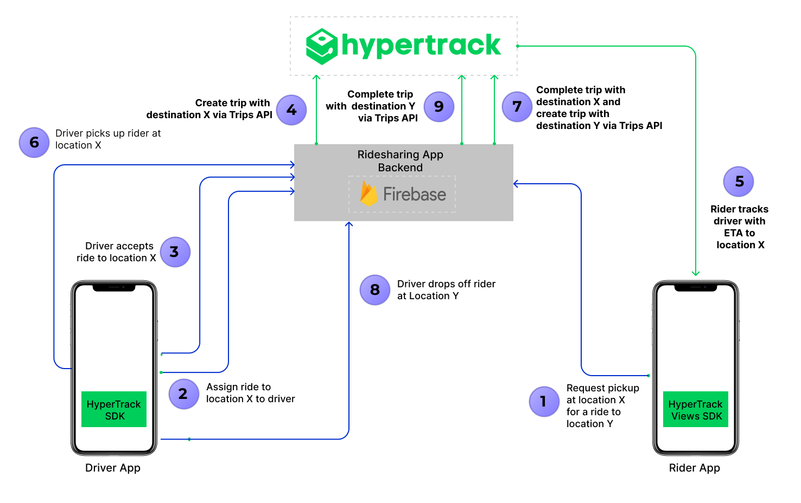

# Ridesharing driver & rider apps using HyperTrack SDK

<p align="center">
  
</p>

Uber’s business model has given rise to a large number of ridesharing services. Among other things, X equals moving, parking,
courier, groceries, flowers, alcohol, dog walks, massages, dry cleaning, vets, medicines, car washes, roadside assistance and marijuana.
Through these on-demand platforms, supply and demand are aggregated online for services to be fulfilled offline.

This open source repo/s uses HyperTrack SDK for developing real world Uber-like consumer & driver apps.

 - **Ridesharing Rider app** can be used by customer to :
      - Allow customer to select pickup and dropoff location
      - Book a ride from desired pickup and dropoff location
      - Track driver to customer's pickup location
      - Track the ongoing ride to dropoff location
      - Let customers share live trip with friends and family
      - Show trip summary with distance travelled

<p align="center">
 <a href="https://www.youtube.com/watch?v=1qMFP5w32GY">
  
 </a>
</p>


- **Ridesharing Driver app** can be used by driver to :
     - Find new rides
     - Accept a ride
     - Track and navigate till customer's pickup location, and mark the pickup as complete
     - Track and navigate from customer's pickup to dropoff location, and mark the dropoff as complete
     - Show trip summary with distance travelled

<p align="center">
 <a href="https://www.youtube.com/watch?v=3R9GDQitt40">
  
 </a>
</p>


## How to Begin

### 1. Get your keys
 - [Signup](https://dashboard.hypertrack.com/signup) to get your [HyperTrack Publishable Key](https://dashboard.hypertrack.com/setup)

### 2. Set up rider & driver app
```bash
# Clone this repository
$ git clone https://github.com/hypertrack/ridesharing-android.git

# cd into the project directory
$ cd ridesharing-android
```

- Add your publishable key in [`app/src/main/AndroidManifest.xml`](https://github.com/hypertrack/ridesharing-android/blob/0e83a02f5f01931f10b278cd7303d18dec948a69/app/src/main/AndroidManifest.xml#L41) for `android:value` key
```
<meta-data
    android:name="com.hypertrack.sdk.PUB_KEY"
    android:value="YOUR_PUBLISHABLE_KEY_HERE" />
```

### 3. Set up Firebase
 - Create a Firebase project. For detail steps refer to _Step 1_: https://firebase.google.com/docs/ios/setup#create-firebase-project
 - Register Driver app with `com.hypertrack.ridesharing.driver.android.github` bundle ID and Rider app with `com.hypertrack.ridesharing.rider.android.github` bundle ID. More details in _Step 2_: https://firebase.google.com/docs/ios/setup#register-app
 - Move Driver app's `GoogleService-Info.plist` to the Driver app target and Rider's to Riders. Described in _Step 3_: https://firebase.google.com/docs/ios/setup#add-config-file No need to follow Step 4 and 5, they are already implemented in the app.
 - Create Cloud Firestore database in test mode by following the "Create a Cloud Firestore database" section from this guide https://firebase.google.com/docs/firestore/quickstart#create No need to foolow other steps, they are already implemented in the app.
 - Follow instructions in our [firebase repo](https://github.com/hypertrack/ridesharing-firebase) to setup Firebase Cloud Functions that act as a backend, interacting with HyperTrack APIs.
 - Note that Firebase Cloud Firestore and Cloud Functions are _not required_ to use HyperTrack SDKs. You may have your own server that is connected to your apps.

### 4. Run the apps

- You can run the Rider and Driver apps in Emulator or on-device.
- Being able to run the apps and signup means that the whole setup works.
- In these samples apps, Driver app creates actions for pickup and drop, which are tracked by Driver & Rider apps. See [architecture](#architecture) for details.

## Documentation
For detailed documentation of the APIs, customizations and what all you can build using HyperTrack, please visit the official [docs](https://docs.hypertrack.com).

## Architecture



1. The driver app uses HyperTrack SDK ([iOS](https://github.com/hypertrack/quickstart-ios)/[Android](https://github.com/hypertrack/quickstart-android)) to send his location, name, and metadata to HyperTrack's servers.
2. Driver and Rider apps use HyperTrack Views ([iOS](https://github.com/hypertrack/views-ios)/[Android](https://github.com/hypertrack/views-android)) to show the driver's current location and trip's route.
3. Driver and Rider apps are subscribed to [Firebase Cloud Firestore](https://firebase.google.com/docs/firestore) to sync users and orders between them.
4. Firebase Cloud Functions react to the order status field in Cloud Firestore, create and complete trips using [HyperTrack APIs](https://docs.hypertrack.com/#guides-apis), listen to [HyperTrack Webhooks](https://docs.hypertrack.com/#guides-webhooks) and update the order status and trip fields with new results.

<details>
    <summary>Step by step process of communication:</summary>

1. Driver sign-ups with his data. This
    1. Creates a new document with driver's data in users collection in Cloud Firestore
    2. Adds the name and metadata through HyperTrack SDK for the driver. HyperTrack SDK starts tracking the driver's location. From this point, the driver can be seen in HyperTrack Dashboard
2. The driver is checking Cloud Firestore's orders collection periodically, looking for orders with the `NEW` status
3. Rider sign-ups with his data. This creates a new document with rider's data in users collection in Cloud Firestore
4. Rider chooses pickup and dropoff places, which creates a new order in orders collection in Cloud Firestore
5. The driver is accepting this order, changing its status to `ACCEPTED` and setting his data in the order
6.  This change triggers `updateOrderStatus` Firebase Cloud Function. The function creates a trip from the driver's current position to the rider's pickup point using HyperTrack API. Then it changes the order status to `PICKING_UP`.
7. Driver and Rider apps are subscribed to their order. When they see that the status is `PICKING_UP`, they use HyperTrackViews SDK to display the trip from the order on a map.
8. When a driver crosses destination geofence of the rider's pickup point, a webhook from HyperTrack to Firebase Cloud Function is triggered. This function updates the order to `REACHED_PICKUP` state.
9. Upon receiving `REACHED_PICKUP` order state, the Driver app shows a "Start Trip" button. When the driver presses it, Driver app changes the order status to `STARTED_RIDE` state
10. Upon receiving the `STARTED_RIDE` state, Firebase Cloud Function call HyperTrack APIs to complete the previous trip and create a new trip to the rider's destination. After the trip is created, the function updates the order status to `DROPPING_OFF`.
11. When Driver and Rider apps see the `PICKING_UP` status, they use HyperTrackViews SDK to display the new trip on a map.
12. When a driver crosses destination geofence of the rider's dropoff point, a webhook from HyperTrack to Firebase Cloud Function triggers again. This function updates the order to `REACHED_DROPOFF` state.
13. Upon receiving `REACHED_DROPOFF` order state, the Driver app shows a "End Trip" button. When the driver presses it, Driver app changes the order status to `COMPLETED` state.
14. Firebase Cloud Function completes the dropoff trip at this point.
15. When this trip is completed, Rider and Driver app show trip summary using HyperTrackViews SDK.

</details>

## How Ridesharing sample apps use HyperTrack SDK

Ridesharing Driver app uses HyperTrack SDK to track driver's position in 3 cases:
- When app is active to display all drivers locations on riders maps
- When driver is picking up rider
- When driver is dropping off rider

You can find the SDK documentation [here](https://github.com/hypertrack/quickstart-android).

### Push notifications

Driver app integrates HyperTrack SDK with push notifictions to:
- Start tracking location immediately when Firebase creates a trip for accepted order
- Stop tracking location when app is backgrounded and there are no trips lift

### SDK Initialization

HyperTrack SDK initializes successfully when nothing prevents it from tracking.

```java
HyperTrack hyperTrack = HyperTrack.getInstance(context, HyperTrackUtils.getPubKey(context));
```

### DeviceID, name and metadata

DeviceID is used to identify a device on HyperTrack. Driver app uses this ID when creating a user in Firebase.
Device name and metadata are displayed in HyperTrack's [dashboard](https://dashboard.hypertrack.com).
To make it easy for operators to find drivers by their name or filter them by metadata, Driver app sets those fields using User model from Firebase:

```java
if (User.USER_ROLE_DRIVER.equals(user.role)) {
    HyperTrack hyperTrack = HyperTrack.getInstance(this, HyperTrackUtils.getPubKey(this));
    hyperTrack.setDeviceName(user.name);
    Map<String, Object> metadata = new HashMap<>();
    metadata.put("name", user.name);
    metadata.put("phone_number", user.phoneNumber);
    Map<String, Object> car = new HashMap<>();
    car.put("model", user.car.model);
    car.put("license_plate", user.car.licensePlate);
    metadata.put("car", car);
    hyperTrack.setDeviceMetadata
    user.deviceId = hyperTrack.getDeviceID();
}
FirebaseFirestoreApi.createUser(user)
        .addOnSuccessListener(new OnSuccessListener<DocumentReference>() {
            @Override
            public void onSuccess(DocumentReference documentReference) {
                Log.d(TAG, "DocumentSnapshot added with ID: " + documentReference.getId());
                user.id = documentReference.getId();
                next(user);
            }
        })
        .addOnFailureListener(new OnFailureListener() {
            @Override
            public void onFailure(@NonNull Exception e) {
                Log.w(TAG, "Error adding document", e);
            }
        });
```

In HyperTrackViews SDK snippets, both Driver and Rider apps are using this ID to display driver on a map.

## How Ridesharing sample apps use HyperTrackViews SDK

Both Rider and Driver apps use [HyperTrackViews SDK](https://github.com/hypertrack/views-android) to display realtime location and trip updates on a map.

### Subscribing to location updates

Both Driver and Rider apps subscribe to driver's location updates using `subscribeToDeviceUpdates(String, DeviceUpdatesHandler)` method:

```java
hyperTrackViews.subscribeToDeviceUpdates(mState.getUser().deviceId, this);

@Override
public void onTripUpdateReceived(Trip trip) {
    if (trip != null && mState.getOrder() != null && trip.getTripId().equals(mState.getOrder().tripId)) {
        mState.updateTrip(trip);
        if (Order.COMPLETED.equals(mState.getOrder().status) && "completed".equals(trip.getStatus())) {
            User user = User.USER_ROLE_DRIVER.equals(mState.getUser().role)
                    ? mState.getOrder().rider : mState.getOrder().driver;
            mView.showTripEndInfo(mState.getTrip(), user);
        }
    }
}
```

### Placing device or trip on a map

Initialize HyperTrackViews and HyperTrackMap.

```java
hyperTrackViews = HyperTrackViews.getInstance(mContext, HyperTrackUtils.getPubKey(context));
GoogleMapAdapter mapAdapter = new GoogleMapAdapter(googleMap, mapConfig);
hyperTrackMap = HyperTrackMap.getInstance(mContext, mapAdapter);
```

#### Rider's map binding:

```java
hyperTrackMap.bind(new GpsLocationProvider(mContext));
```

After the order has driver's info and `trip_id`:

```java
if (mState.driver == null) {
    GoogleMapAdapter mapAdapter = new GoogleMapAdapter(googleMap, driverMapConfig);
    mapAdapter.addTripFilter(this);
    mState.driver = HyperTrackMap.getInstance(mContext, mapAdapter);
    mState.driver.bind(hyperTrackViews, deviceId);
}
if (!TextUtils.isEmpty(mState.getOrder().tripId)) {
    mState.driver.subscribeTrip(mState.getOrder().tripId);
}
```

#### Driver's map binding:

```java
hyperTrackMap.bind(hyperTrackViews, mState.getUser().deviceId);
hyperTrackMap.adapter().addTripFilter(this);
```

### Making the device or trip center on a map

In apps that show tracking data, usually user needs to see all the data on the screen, be it current location, trip polylines or destination markers. This view needs to re-zoom with animation every time the data is changing. This is done in the real Uber app.

```java
mapAdapter.setCameraFixedEnabled(true);
```

## Contribute
Feel free to clone, use, and contribute back via [pull requests](https://help.github.com/articles/about-pull-requests/). We'd love to see your pull requests - send them in! Please use the [issues tracker](https://github.com/hypertrack/ridesharing-android/issues) to raise bug reports and feature requests.

We are excited to see what live location feature you build in your app using this project. Do ping us at help@hypertrack.com once you build one, and we would love to feature your app on our blog!

## Support
Join our [Slack community](https://join.slack.com/t/hypertracksupport/shared_invite/enQtNDA0MDYxMzY1MDMxLTdmNDQ1ZDA1MTQxOTU2NTgwZTNiMzUyZDk0OThlMmJkNmE0ZGI2NGY2ZGRhYjY0Yzc0NTJlZWY2ZmE5ZTA2NjI) for instant responses. You can also email us at help@hypertrack.com.
