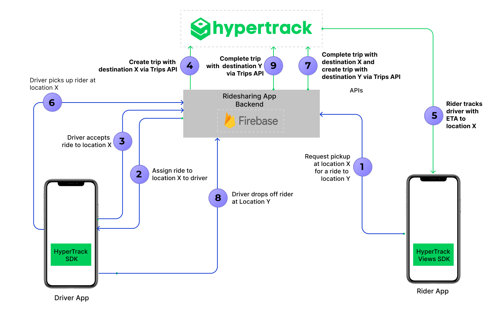

# Build ridesharing driver & rider apps using HyperTrack SDKs

<p align="center">👉 <a href="https://github.com/hypertrack/ridesharing-ios">Looking for the iOS version?</a></p>

<p align="center">
  
</p>

We have now entered the second decade of a large variety of ridesharing services, such as ridesharing, gig work and on-demand delivery.

These ridesharing services include moving, parking, courier, groceries, flowers, dog walks, massages, dry cleaning, vets, medicines, car washes, roadside assistance, cannabis and more.

Through these on-demand platforms, supply and demand are aggregated online for services to be fulfilled offline.

# Ridesharing apps introduction

This open source repo/s uses HyperTrack SDK for developing real world Uber-like consumer & driver apps.

Learnings from this project can be applied to many of the ridesharing services listed above.

A customer requests a pick up at a location chosen by the customer. The pickup order is dispatched to drivers who are available within an area of reach. One of the drivers picks up the customer's request and proceeds to the customer's location for a pick up. Once the pick up takes place, the driver will transport the customer to a destination chosen by the customer.

## Ridesharing rider app

 - **Ridesharing Rider app** can be used by customer to :
      - Allow customer to select pickup and dropoff location
      - Book a ride from desired pickup and dropoff location
      - Track driver to customer's pickup location
      - Track the ongoing ride to dropoff location
      - Let customers share live trip with friends and family
      - Show trip summary with distance travelled

<p align="center">
 <a href="https://www.youtube.com/watch?v=1qMFP5w32GY">
  
 </a>
</p>

### Note

Customer app does not track location of the customer. No location permissions are necessary to be requested from the customer to support the tracking experience.

## Ridesharing driver app

- **Ridesharing Driver app** can be used by driver to :
     - Find new rides
     - Accept a ride
     - Track and navigate till customer's pickup location, and mark the pickup as complete
     - Track and navigate from customer's pickup to dropoff location, and mark the dropoff as complete
     - Show trip summary with distance travelled

<p align="center">
 <a href="https://www.youtube.com/watch?v=3R9GDQitt40">
  
 </a>
</p>

### Note

Driver app tracks the driver. Location and motion permissions are necessary to be requested from the driver to track an order.

# Architecture review

- The Driver App uses HyperTrack SDK ([iOS](https://github.com/hypertrack/quickstart-ios)/[Android](https://github.com/hypertrack/quickstart-android)) to send its location, name, and metadata to HyperTrack's servers
- Driver and Rider Apps use HyperTrack Views SDK ([iOS](https://github.com/hypertrack/views-ios)/[Android](https://github.com/hypertrack/views-android)) to show the driver's current location and trip's route
- Driver and Rider Apps are subscribed to [Firebase Cloud Firestore](https://firebase.google.com/docs/firestore) to sync users and orders between them
- Firebase Cloud Functions react to the order status field in Cloud Firestore, create and complete trips using [HyperTrack Trips APIs](https://www.hypertrack.com/docs/guides/track-trips-with-destination), listen to [HyperTrack Webhooks](https://www.hypertrack.com/docs/guides/track-trips-with-destination#get-trip-updates-on-webhooks) and update the order status and trip fields with new results



<details>
    <summary>Step by step process of communication:</summary>

1. **Request pickup at location X for a ride to location Y**
   - Prior to requesting a pickup, Rider App has already signed up with Ride Sharing App Backend. Ride Sharing App Backend created a new document with the rider's data in its users collection
   - The rider chooses pickup and dropoff places. Rider App sends a request to Ride Sharing App Backend, which creates a new order in its orders collection in Cloud Firestore
2. **Assign ride to location X to driver**
   - Prior to the assignment, Driver App already signed up with Ride Sharing App Backend:
     - Ride Sharing App Backend created a new document with the driver's data in its users collection in Cloud Firestore
     - Driver App added name and metadata through HyperTrack SDK
     - HyperTrack SDK started tracking the driver's location  
     - From this point, the driver can be seen in HyperTrack Dashboard
3. **Driver accepts ride to location X**
   - Driver App is checking with Ride Sharing App Backend periodically, looking for orders with the `NEW` status
   - Once the new order(s) show up, the driver can accept a chosen order. Ride Sharing Backend changes the order status to `ACCEPTED` and sets the driver's data in the order 
4. **Create trip with destination X via Trips API**
   - Once the order status is changed, Ride Sharing Backend triggers `updateOrderStatus` Firebase Cloud Function. The function creates a trip from the driver's current position to the rider's pickup point using [HyperTrack API](https://www.hypertrack.com/docs/guides/track-trips-with-destination). Once the troop is created, the order status is changed to `PICKING_UP`.
5. **Rider tracks driver with ETA to location**
   - Driver and Rider Apps are subscribed to their order. When they see that the status is `PICKING_UP`, they use HyperTrackViews SDK to display the trip live from the order on a map
6. **Driver picks up rider at location X**
   - When the driver crosses destination geofence of the rider's pickup point, a webhook from HyperTrack to Ride Sharing App Backend's Firebase Cloud Function is triggered. This function updates the order to `REACHED_PICKUP` state
7. **Complete trip with destination X and create trip with destination Y via Trips API**
   - Upon receiving `REACHED_PICKUP` order state, Driver App shows a "Start Trip" button. When the driver presses it, Driver App changes the order status to `STARTED_RIDE` state
   - Upon receiving the `STARTED_RIDE` state, Ride Sharing App Backend's Firebase Cloud Function calls [HyperTrack APIs](https://www.hypertrack.com/docs/guides/track-trips-with-destination) to complete the previous trip and creates a new trip to the rider's destination. After the trip is created, the function updates the order status to `DROPPING_OFF`
   - When Driver and Rider Apps see `PICKING_UP` status, they both use HyperTrack Views SDK to display the new trip on a map
8. **Driver drops off rider at Location Y**
   - When the driver crosses the destination geofence of the rider's dropoff point, a webhook from HyperTrack to Ride Sharing App Backend's Firebase Cloud Function triggers again. This function updates the order to `REACHED_DROPOFF` state
   - Upon receiving `REACHED_DROPOFF` order state, the Driver app shows a "End Trip" button. When the driver presses it, Driver app changes the order status to `COMPLETED` state
9. **Complete trip  with  destination Y via Trips API**
   - Ride Sharing App Backend's Firebase Cloud Function proceeds to call [HyperTrack APIs](https://www.hypertrack.com/docs/guides/track-trips-with-destination) complete the dropoff trip 
   - When this trip is completed, Rider and Driver Apps show trip summary using HyperTrack Views SDK
</details>

# How Ridesharing sample apps use HyperTrack API

Ridesharing apps use [HyperTrack Trips API](https://www.hypertrack.com/docs/guides/track-trips-with-destination) to [create](https://www.hypertrack.com/docs/references/#references-apis-trips-start-trip-with-destination) and [complete](https://www.hypertrack.com/docs/references/#references-apis-trips-complete-trip) trips by using Firebase Cloud Functions. Firebase allows ridesharing sample appilcations integrate with HyperTrack Trips API via backend server integration.

For each rider's request that is accepted by the driver, a trip is [created](https://www.hypertrack.com/docs/references/#references-apis-trips-start-trip-with-destination) for the driver to pick up the rider at the rider's location. Once the pick up is completed, the trip is [completed](https://www.hypertrack.com/docs/references/#references-apis-trips-complete-trip) and then the new trip is [created](https://www.hypertrack.com/docs/references/#references-apis-trips-start-trip-with-destination) for the driver to get the rider to rider's destination. Once the rider reaches the destination and is dropped off, the trip is [completed](https://www.hypertrack.com/docs/references/#references-apis-trips-complete-trip).

Follow instructions in our [firebase repo](https://github.com/hypertrack/ridesharing-firebase) to setup Firebase Cloud Functions that act as a backend, interacting with HyperTrack APIs described above.
 
# Extend your ridesharing backend to do more

You can extend the [firebase repository](https://github.com/hypertrack/ridesharing-firebase) once you get familiarized with the following concepts:

- Customer and driver registration and management
- Customer order requests
- Find nearby drivers and assign customer order requests with [Nearby API](https://hypertrack.com/docs/guides/dispatch-work-to-nearby-devices)
- Receive driver acceptance for orders
- Manage trips to customer's pickup and drop off locations with [Trips API](https://hypertrack.com/docs/guides/track-live-route-and-eta-to-destination)

## Customer order

On-demand customer downloads and installs the customer app and signs in. Customer can use the app to book an order.

## Customer registration

Your customer app and ridesharing backend implement customer registration by capturing customer's identity and verifying customer's credentials. You store customer's information in your ridesharing backend. The customer's identity and credentials are used to authenticate customer's order request and present to assigned drivers.

## Order execution

The customer picks a location and orders a pickup to go to a destination. The ridesharing backend receives the order and stores it in its database for the next step. This step will involve finding available drivers near pickup location as explained below.

## Driver registration

The driver downloads the driver app, registers and authenticates to your ridesharing backend. In the process of registration, driver app captures driver's `device_id` from HyperTrack SDK which is sent to ridesharing backend along with the driver's identity and credentials.

## Identify drivers

In order to provide a great ridesharing experience for customers, add driver identity as the name for your driver's device. The driver's name will show in your customer's app.

Review instructions on how to set [device name and metadata](/docs/guides/setup-and-manage-devices#setting-device-name-and-metadata) and make a decision on what works best for your ridesharing app.

For example, the device name can be a driver's name or some other identifier you use in your system with example below:

```shell script
{
  "name": "Kanav",
  "metadata": {
    "model": "i3",
    "make": "BMW",
    "color": "blue"
  }
}
```

## Locate nearby drivers

Live location is an important input to the driver dispatch algorithm to request a pickup and dropoff. 

For further details, documentation and code examples, please review [Nearby API guide](/docs/guides/dispatch-work-to-nearby-devices).

Nearby API locates app users on demand, figures out which ones are nearest to the location of interest, and returns them as an ordered list with nearest first. 

## Assign and accept order

Once nearby available drivers located, customer's request is assigned to available drivers by your ridesharing backend and presented in their driver app. One of the drivers can accept the order and drive to the pickup location.

## Assign order request to available drivers

Ridesharing backend receives results of [Nearby API](#locate-nearby-drivers) and assigns order request to the nearest available drivers. Your driver app presents the pickup order in the screen to each of these available drivers, along with the identity of the customer and pickup location.

## Driver acceptance

As illustrated in the image above, driver app gives an opportunity for the driver to accept an assigned order. Once the driver accepts the order, your ridesharing backend proceeds to create a trip for the driver to the pickup location as explained below.

## Track driver to customer pickup location

Once the driver accepted the pickup order, your ridesharing backend proceeds to work with Trips API to create a trip for the driver to the destination at pickup location and provide a real-time tracking experience to the customer.

To create driver tracking experience for the customer, create a trip with ETA to the pickup destination. Once the pickup order is accepted by the driver, inside your ridesharing backend, Use [Trips API](/docs/guides/track-live-route-and-eta-to-destination#create-a-trip-with-destination) to create a trip for driver.

## Create driver trip tracking experience in customer app

Once the driver accepts the order, your customer app should immediately start showing driver's location with the expected route to the pick up destination and displays ETA in real-time. From the steps above, your ridesharing backend created a trip for the driver to the pick up destination. The `trip_id` for this trip is stored by your ridesharing backend and is associated with the order.

Customer app uses Views SDK to receive trip status and real-time updates. Your customer app uses callbacks to receive this data and show them in the customer app.

Please review [stream data to native apps guide](/docs/guides/stream-data-to-native-apps) to understand how this is done for iOS and Android apps using Views SDK. Once you integrate Views SDK with the customer app, the customer will be able to:

- See driver moving to the pickup destination in real-timel with an expected route
- Observe route changes as driver diverges from the expected route
- Observe ETA in real-time
- Receive delay notifications in the app

## Share tracking updates

As the driver transports the customer to the drop off destination, you can provide real-time location tracking experience to the customer, customer's family, and friends. This can be done with the share URL link as explained below.

### Share URL for trip to drop off location

Trips API gives you an ability for you, as a developer, to create live, real-time, high fidelity, location sharing with your customer via `share_url` link.

Please see an image below for a mobile location sharing viewing experience in the web browser. This link can be shared with family and friend. Once they receive the link, the web browser will continually display and update the location of the driver's device as it moves towards the drop off destination while ETA is updated live.

<p align="center">

</p>

Share URL has the following structure: <code>https://trck.at/{7_digit_tracking_id}</code>.

This makes it a total of 23 characters, and therefore a friendly URL to share via text or other messengers. Share URLs stay accessible permanently and show trip summary after trip completion.

## Generate order summary

Once the oder to the drop off destination is complete, your ridesharing backend completes the trip and generates a trip summary that can be shared with both customer and the driver.

A final trip summary view for a trip may look like this:

<p align="center">

</p>

## Generate trip summary data

Once the trip is complete, your ridesharing backend can obtain detailed trip summary with distance from the pick up destination to drop off destination, including time spent as an input into your app to calculate billing charges for the customer. Please review [this section](https://hypertrack.com/docs/guides/track-live-route-and-eta-to-destination#getting-trip-summary) to get detailed information on the trip summary data structure.

## How Ridesharing sample apps use HyperTrack SDK

Ridesharing Driver app uses HyperTrack SDK to track driver's position in 3 cases:
- When app is active to display all drivers locations on riders maps
- When driver is picking up rider
- When driver is dropping off rider

You can find the SDK documentation [here](https://github.com/hypertrack/quickstart-android).

### Push notifications

Driver app integrates HyperTrack SDK with push notifictions to:
- Start tracking location immediately when Firebase creates a trip for accepted order
- Stop tracking location when app is backgrounded and there are no trips left

### SDK Initialization

HyperTrack SDK initializes successfully when nothing prevents it from tracking.

```java
HyperTrack hyperTrack = HyperTrack.getInstance(context, HyperTrackUtils.getPubKey(context));
```

### DeviceID, name and metadata

DeviceID is used to identify a device on HyperTrack. Driver app uses this ID when creating a user in Firebase.
Device name and metadata are displayed in HyperTrack's [dashboard](https://dashboard.hypertrack.com).
To make it easy for operators to find drivers by their name or filter them by metadata, Driver app sets those fields using User model from Firebase:

```java
if (User.USER_ROLE_DRIVER.equals(user.role)) {
    HyperTrack hyperTrack = HyperTrack.getInstance(this, HyperTrackUtils.getPubKey(this));
    hyperTrack.setDeviceName(user.name);
    Map<String, Object> metadata = new HashMap<>();
    metadata.put("name", user.name);
    metadata.put("phone_number", user.phoneNumber);
    Map<String, Object> car = new HashMap<>();
    car.put("model", user.car.model);
    car.put("license_plate", user.car.licensePlate);
    metadata.put("car", car);
    hyperTrack.setDeviceMetadata
    user.deviceId = hyperTrack.getDeviceID();
}
FirebaseFirestoreApi.createUser(user)
        .addOnSuccessListener(new OnSuccessListener<DocumentReference>() {
            @Override
            public void onSuccess(DocumentReference documentReference) {
                Log.d(TAG, "DocumentSnapshot added with ID: " + documentReference.getId());
                user.id = documentReference.getId();
                next(user);
            }
        })
        .addOnFailureListener(new OnFailureListener() {
            @Override
            public void onFailure(@NonNull Exception e) {
                Log.w(TAG, "Error adding document", e);
            }
        });
```

In HyperTrackViews SDK snippets, both Driver and Rider apps are using this ID to display driver on a map.

## How Ridesharing sample apps use HyperTrack Views SDK

Both Rider and Driver apps use [HyperTrackViews SDK](https://github.com/hypertrack/views-android) to display realtime location and trip updates on a map.

### Subscribing to location updates

Both Driver and Rider apps subscribe to driver's location updates using `subscribeToDeviceUpdates(String, DeviceUpdatesHandler)` method:

```java
hyperTrackViews.subscribeToDeviceUpdates(mState.getUser().deviceId, this);

@Override
public void onTripUpdateReceived(Trip trip) {
    if (trip != null && mState.getOrder() != null && trip.getTripId().equals(mState.getOrder().tripId)) {
        mState.updateTrip(trip);
        if (Order.COMPLETED.equals(mState.getOrder().status) && "completed".equals(trip.getStatus())) {
            User user = User.USER_ROLE_DRIVER.equals(mState.getUser().role)
                    ? mState.getOrder().rider : mState.getOrder().driver;
            mView.showTripEndInfo(mState.getTrip(), user);
        }
    }
}
```

### Placing device or trip on a map

Initialize HyperTrackViews and HyperTrackMap.

```java
hyperTrackViews = HyperTrackViews.getInstance(mContext, HyperTrackUtils.getPubKey(context));
GoogleMapAdapter mapAdapter = new GoogleMapAdapter(googleMap, mapConfig);
hyperTrackMap = HyperTrackMap.getInstance(mContext, mapAdapter);
```

#### Rider's map binding:

```java
hyperTrackMap.bind(new GpsLocationProvider(mContext));
```

After the order has driver's info and `trip_id`:

```java
if (mState.driver == null) {
    GoogleMapAdapter mapAdapter = new GoogleMapAdapter(googleMap, driverMapConfig);
    mapAdapter.addTripFilter(this);
    mState.driver = HyperTrackMap.getInstance(mContext, mapAdapter);
    mState.driver.bind(hyperTrackViews, deviceId);
}
if (!TextUtils.isEmpty(mState.getOrder().tripId)) {
    mState.driver.subscribeTrip(mState.getOrder().tripId);
}
```

#### Driver's map binding:

```java
hyperTrackMap.bind(hyperTrackViews, mState.getUser().deviceId);
hyperTrackMap.adapter().addTripFilter(this);
```

### Making the device or trip center on a map

In apps that show tracking data, usually user needs to see all the data on the screen, be it current location, trip polylines or destination markers. This view needs to re-zoom with animation every time the data is changing. This is done in the real Uber app.

```java
mapAdapter.setCameraFixedEnabled(true);
```

## How to Begin

### 1. Get your keys
 - [Signup](https://dashboard.hypertrack.com/signup) to get your [HyperTrack Publishable Key](https://dashboard.hypertrack.com/setup)

### 2. Set up rider & driver app
```bash
# Clone this repository
$ git clone https://github.com/hypertrack/ridesharing-android.git

# cd into the project directory
$ cd ridesharing-android
```

- Add your publishable key in [`app/src/main/AndroidManifest.xml`](https://github.com/hypertrack/ridesharing-android/blob/0e83a02f5f01931f10b278cd7303d18dec948a69/app/src/main/AndroidManifest.xml#L41) for `android:value` key
```
<meta-data
    android:name="com.hypertrack.sdk.PUB_KEY"
    android:value="YOUR_PUBLISHABLE_KEY_HERE" />
```

### 3. Set up Firebase
 - Create a Firebase project. For detail steps refer to _Step 1_: https://firebase.google.com/docs/android/setup#create-firebase-project
 - Register Driver app with `com.hypertrack.ridesharing.driver.android.github` bundle ID and Rider app with `com.hypertrack.ridesharing.rider.android.github` bundle ID. More details in _Step 2_: https://firebase.google.com/docs/android/setup#register-app
 - Add a Firebase configuration file `google-services.json`(Described in _Step 3_1: https://firebase.google.com/docs/android/setup#add-config-file) to ridesharing-android/app
 - Create Cloud Firestore database in test mode by following the "Create a Cloud Firestore database" section from this guide https://firebase.google.com/docs/firestore/quickstart#create No need to foolow other steps, they are already implemented in the app.
 - Follow instructions in our [firebase repo](https://github.com/hypertrack/ridesharing-firebase) to setup Firebase Cloud Functions that act as a backend, interacting with HyperTrack APIs.
 - Note that Firebase Cloud Firestore and Cloud Functions are _not required_ to use HyperTrack SDKs. You may have your own server that is connected to your apps.

### 4. Run the apps

- You can run the Rider and Driver apps in Emulator or on-device.
- Change the driver or rider [build variant](https://developer.android.com/studio/run#changing-variant) to build different apps.
- Being able to run the apps and signup means that the whole setup works.
- In these samples apps, Driver app creates actions for pickup and drop, which are tracked by Driver & Rider apps. See [architecture](#architecture) for details.

## Documentation
For detailed documentation of the APIs, customizations and what all you can build using HyperTrack, please visit the official [docs](https://hypertrack.com/docs/references/#references-apis).

## Contribute
Feel free to clone, use, and contribute back via [pull requests](https://help.github.com/articles/about-pull-requests/). We'd love to see your pull requests - send them in! Please use the [issues tracker](https://github.com/hypertrack/ridesharing-android/issues) to raise bug reports and feature requests.

We are excited to see what live location feature you build in your app using this project. Do ping us at help@hypertrack.com once you build one, and we would love to feature your app on our blog!

## Support
Join our [Slack community](https://join.slack.com/t/hypertracksupport/shared_invite/enQtNDA0MDYxMzY1MDMxLTdmNDQ1ZDA1MTQxOTU2NTgwZTNiMzUyZDk0OThlMmJkNmE0ZGI2NGY2ZGRhYjY0Yzc0NTJlZWY2ZmE5ZTA2NjI) for instant responses. You can also email us at help@hypertrack.com.
